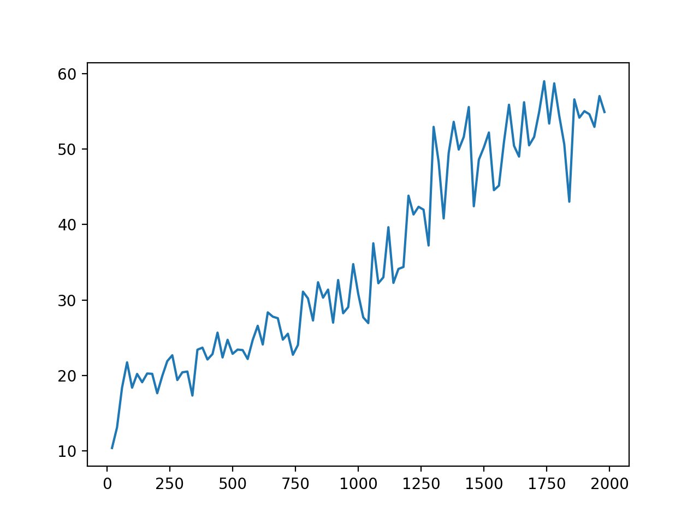

# Deep Reinforcement Learning with DQN algorithm
Final project for CSE150A:Intro to AI:Probabilistic Reasoning. Member: Yuan Gao

## Summary
In the class we talked about one of the traditional methods for Markov Decision Process and Reinforcement learning: by using policy iteration, value interation, and Q updating, we could find the optimized values and Q values for each state. However, with the increasing complexity of the environment in modern RL problems, it is unefficiency and energy consuming if we still keep a discrete Q table/state-action table and do the updates. For instance, say an agent is trained to play a go game. The combination of the board of go and the action taken is extremely large. To overcome this problem, researchers from all of the world comes up with different method, including off-policy ones like TRPO and PPO, on-policy ones like SARSA. Here I am training the DQN algorithm developed by DeepMind in 2015 that brought AI into public attention and testing it on several games from OpenAI. For some games like mountain car, the result turns out to be good even without spending a lot of time tuning those hyperparamters. For others like CartPole, however, better hyperparameters helps a lot.

## Methodology
For this project, I build a Deep QNet(# of states -> 64(Relu) -> 32(Relu) -> # of actions) from scratch which combines deep learning with Q learning using TF2.0. I also used epsilon-greedy to choose action, a replay buffer to sample training data, and a evaluation network and a target network to compute the loss(the structure is described on the [DQN paper](https://www.nature.com/articles/nature14236.pdf). The reason I used epsilon-greedy, specifically dynamic epsilon-greedy, is that I want the agent to explore as far as possible to gain enough information at first, and then in order to prevent exploitation, the episilon will decay every epoch to make sure once enough information are gathered, it will choose the optimum solution with more confidence. The reply buffer serves as a pool where we put all the information inside(all the steps taken before together with the rewards collected). The reason why this buffer is useful is that 1) it creates independence between each training data, which is vital for a neural network, and 2) it makes useful of previous experience so all of the data can be used thoroughly. While training, we randomly choose a batch of steps and feed into the neural network, compute the gradient, and use Adam optimizer to minimize the loss, which is defined as

The blue part is represented by target network, and black part by evaluation network. Note that **We are only training the evaluation network**, and the target network only serves as a reference when we compute the loss. Also, we need to update the 
target network by setting them equal to the training network after a certain time step to improve the loss function.

## Assessment
Typical reward curve for **naive** deep reinforcement learning, unlike supervised learning, can be hard to converge and is really noisy, unless the very good hyperparameters are chosen. For this project, given time constrained(8 hours per person), I didn't spend a lot of time tuning the hyperparameters. However, the cartpole and mountaincar game of my network seems pretty decent after some training. Also, since the dqn.py and utils.py and be shared between different games, the user only need to modify the main function.

Here is the reward curve of a random 2000 iterations of mountain car

Here is what the reward curve looks like for 2000 iterations for the CartPole game. This one is the best result after I run the program 3 times:

However, as dqn is getting improved again and again by researchers, and more and more advanced dqn (double dqn, dueling dqn, etc) are coming out, my agent may not be the strongest. But during this project, I have learned why and how people came up with deep reinforcement learning, and have gained experience in writing TF and debugging.

## Reference

