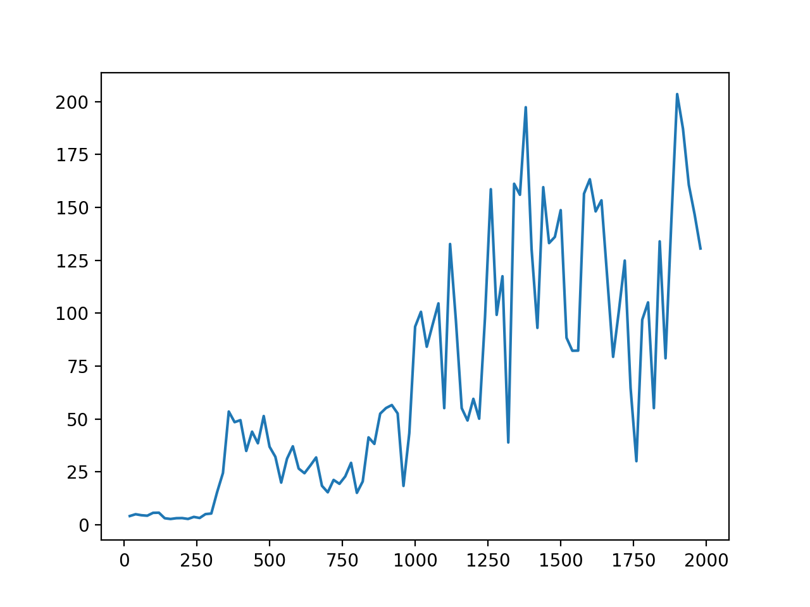
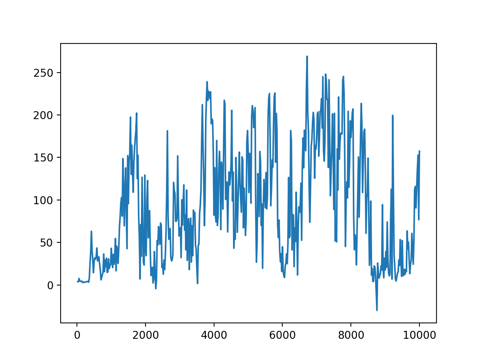

# Deep_Reinforcement_Learning
Final project for CSE150A:Intro to AI:Probabilistic Reasoning. 

Here I will build a Deep QNet from scratch which combines deep learning with Q learning using TF2.0. My goal is to fit the QNet to play several games on OpenAI's Gym.

[Here](https://www.nature.com/articles/nature14236.pdf) is the classical paper about DQN

Typical reward curve for **naive** deep reinforcement learning: unlike supervised learning, it hardly converges and is really noisy, unless the very good hyperparameters are chosen. However, you can see the demo video of the cartpole after 1000 iterations of my code, which is pretty nutty.

Here is what the reward curve looks like for 2000 iterations. This one is the best result after I run the program 6 times:

Here is a more general reward curve that I randomly trained 10k iterations

